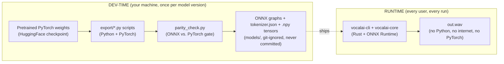

# vocal-ai — Architecture (plain-language companion)

> **Audience**: this doc assumes no prior ML background. If you already know what
> "inference", "ONNX", and "autoregressive decoding" mean, read
> `docs/phase1-onnx-rust-cli-plan.md` instead — it's the authoritative, denser
> version this doc is a companion to. Nothing here overrides that plan; if the
> two ever disagree, the plan doc wins and this one is stale.

---

## 1. What Chatterbox TTS actually is

**Chatterbox** ([`resemble-ai/chatterbox`](https://github.com/resemble-ai/chatterbox)) is
a pretrained neural text-to-speech model. "Pretrained" means someone else already spent
weeks of GPU time and a large audio dataset training it — we never train anything. We only
**run** it: feed in text (and optionally a reference voice clip), get a waveform out.

It's not one giant network — it's **four separate neural networks** wired together by a
thin layer of Python control-flow (loops, math, sampling logic). That decomposition is the
whole reason this project is possible without a research team:

| # | Network | Job | Analogy |
|---|---------|-----|---------|
| 1 | **Voice Encoder (VE)** | Reference audio → a short vector ("speaker embedding") that captures *how this voice sounds* | A fingerprint scanner: audio in, fixed-size fingerprint out |
| 2 | **T3** (a Llama-style transformer) | Text + speaker embedding → a sequence of "speech tokens" (like word tokens, but for sound) | A translator that writes in a phonetic code instead of English |
| 3 | **S3Gen** (flow-matching model + vocoder) | Speech tokens → a mel spectrogram → a raw waveform | A synthesizer that turns the phonetic code into an actual sound wave |
| 4 | **PerthNet** | Waveform → same waveform + an inaudible watermark | A stamp that marks the audio as AI-generated, without changing how it sounds |

None of these four need to be run *simultaneously* or share memory in exotic ways — they run
in strict sequence, each one's output feeding the next one's input. That sequential,
decoupled structure is what makes ONNX export (§3) tractable.

## 2. Why not just run the Python version as-is?

We could `pip install chatterbox-tts` and call it a day. Two problems, covered in
[ADR-002](decisions/0002-onnx-plus-rust-runtime.md):

1. **It's not a standalone tool.** It needs a Python interpreter, PyTorch (a multi-GB
   library), and downloads multi-GB model weights from the internet on first run. We want
   `vocalai --text "hello" --out out.wav` to be one binary you double-click/run — nothing
   else installed, nothing downloaded at runtime.
2. **PyTorch's memory manager behaves badly on Apple Silicon.** On an M3 Max, a single
   generation pushed macOS swap from ~5 GB to ~30 GB. We want to control memory ourselves.

The fix: **freeze each of the 4 networks into a portable file (ONNX export, dev-time,
Python), then run all 4 from a single native Rust binary (runtime, no Python at all)**.
Rust was chosen over C++ for this rewrite — see
[ADR-003](decisions/0003-rust-over-cpp.md) — mainly because C++'s one advantage
(`onnxruntime-genai`'s built-in decode loop) doesn't actually apply to this model's
architecture.

## 3. Two separate worlds: dev-time export vs. runtime inference

This is the single most important mental model for this repo. There are **two completely
separate programs**, running at **different times**, written in **different languages**,
and **only one of them ships to end users**:



This is a simplified view — the detailed version, including the voice-conditioning branch and
every module by name, is `docs/architecture-diagram.drawio.xml`.

**Nothing in `export/` ever ships to a user.** It exists purely so we (developers) can turn
"a PyTorch model" into "a handful of static files a Rust program can read." Once exported,
Python is out of the picture entirely.

"Static graph" is the key term — see §4.

## 4. What "ONNX export" actually means

A neural network, once trained, is just **a fixed sequence of math operations** (matrix
multiplies, additions, activation functions) applied to numbers. "Exporting to ONNX" means:
run the network once in PyTorch with example input, record every math operation that
happened, and save that recording as a graph file (`.onnx`) — a language-independent
description of "do this multiply, then this add, then this...". Any runtime that understands
the ONNX format (like Microsoft's **ONNX Runtime**, which the Rust `ort` crate wraps) can
then replay that exact graph, with new inputs, in any language — no Python required.

The catch: this only works cleanly for parts of the model that don't change shape or take a
different code path each time (a "static graph"). Chatterbox's T3 and S3Gen networks are
*used* inside loops (§6), but each individual step through the loop is a plain static forward
pass — the looping itself is ordinary Python `for`-loop code sitting *outside* the network,
not inside it. That's why export is realistic here: we export the "one step" networks, and
rewrite the outer loop in Rust.

## 5. Module map

> For current done/planned status per module, see `docs/agents/STATUS.md`'s phase table — that's
> the one place this project tracks status, so it doesn't go stale here every time a milestone
> lands. The tables below describe *what* each module does, which changes far less often.

### Rust runtime (ships to users)

| Path | Responsibility |
|---|---|
| `crates/vocalai-cli/src/main.rs` | Parses CLI flags (`--text`, `--voice`, `--out`, sampling params), calls into `vocalai-core`, writes the WAV |
| `crates/vocalai-core/src/session.rs` | Picks which hardware to run on (CoreML → CPU on Mac, CUDA → CPU on Windows/Linux) for every ONNX Runtime session |
| `crates/vocalai-core/src/tokenizer.rs` | Turns input text into token IDs the T3 network understands (`tokenizer.json`, no ONNX needed — this is a pure lookup table + rules, not a neural net) |
| `crates/vocalai-core/src/pipeline.rs` | Wires every module below into the end-to-end request flow (§7); assembles `VoiceConditioning` — either the built-in default voice (`VoiceConditioning::load_default`) or a `--voice` reference clip (`VoiceConditioning::from_reference`) |
| `crates/vocalai-core/src/mel.rs` | Four mel/fbank "flavors" the different networks each expect: VE's unscaled power-mel, the S3-tokenizer's Whisper-style log-mel, S3Gen's natural-log 24kHz mel, and CAMPPlus's Kaldi-style log-fbank |
| `crates/vocalai-core/src/voice_encoder.rs` | Runs the VE ONNX graph: reference `.wav` → mel spectrogram (via `mel.rs`) → speaker embedding vector, including silence-trim and partial-utterance striding ported from the Python reference |
| `crates/vocalai-core/src/s3tokenizer.rs` | Runs the S3-tokenizer ONNX graph: reference audio → speech tokens, reused for both T3's `cond_prompt_speech_tokens` and S3Gen's `prompt_token` |
| `crates/vocalai-core/src/campplus.rs` | Runs the CAMPPlus ONNX graph over exactly 400 real Kaldi-fbank frames (fixed-size graph, see §9's ADR-0009 link) to produce the speaker x-vector S3Gen's conditioning needs |
| `crates/vocalai-core/src/t3.rs` | Runs the T3 ONNX graph **repeatedly**, one token at a time, with sampling logic (temperature, repetition penalty, top-p, min-p, classifier-free guidance) — the "autoregressive decode loop" |
| `crates/vocalai-core/src/s3gen.rs` | Runs the S3Gen ONNX graph **repeatedly** (~10 fixed steps, an "ODE solver loop"), turning speech tokens into a mel spectrogram, then chains into the HiFiGAN vocoder graph → raw waveform |
| `crates/vocalai-core/src/watermark.rs` | Runs the PerthNet ONNX graph over the finished waveform |
| `crates/vocalai-core/src/audio.rs` | WAV file I/O and resampling (voice prompts get resampled to 16 kHz; output is 24 kHz) |

### Python export toolchain (dev-time only, never shipped)

| Path | Responsibility |
|---|---|
| `export/requirements.txt` | Pins the Python env used to load Chatterbox + do the export (`chatterbox-tts`, `torch`, `onnx`, `onnxruntime`) |
| `export/fetch_tokenizer.py` | Downloads `tokenizer.json` — not exported, no ONNX graph involved |
| `export/export_ve.py`, `export_s3tokenizer.py`, `export_hifigan.py` | Trace VE / S3 tokenizer / HiFiGAN to static ONNX graphs (easiest — no loops inside them) |
| `export/export_s3gen.py` | Trace the S3Gen *single-step* flow estimator to ONNX (the loop stays in Rust, §6) |
| `export/export_s3gen_flow_encoder.py` | Trace S3Gen's flow-encoder to ONNX as 6 fixed-length token-count buckets (`TOKEN_BUCKETS`) — a first dynamic-length attempt hit third-party export bugs, see ADR-0009 |
| `export/export_campplus.py` | Trace CAMPPlus to ONNX as one fixed 400-frame graph, same ADR-0009 reasoning |
| `export/export_t3.py` | Trace T3 as a "decoder-with-past" graph — one token-step in, with explicit cache tensors in/out (§6) |
| `export/export_perthnet.py` | Export PerthNet from the external `resemble-perth` package |
| `export/export_default_voice.py` | Dumps the built-in default voice's conditioning tensors (`conds.pt`) to `.npy` files under `models/default_voice/` |
| `export/parity_check.py` | Feeds the same input through the PyTorch original *and* the exported ONNX graph, checks the outputs match within tolerance — the gate before any export can be used (`CLAUDE.md` §1) |

Run all of the above with one command — `make export` (see `docs/dev-setup.md` §9 for the
`--with-voice-cloning` flag and the manual per-script fallback).

## 6. What "inferencing" means here (no training involved, ever)

"Inference" just means: *run the already-trained network forward, to get an output* — as
opposed to *training*, which adjusts the network's internal numbers using labeled examples.
This project only ever does inference; the weights are frozen and never change.

Two of the four networks are used inside a loop, driven from plain host-language code (first
Python in the reference implementation, and — after export — Rust):

- **T3's loop is "autoregressive decoding"**: generate one speech token, feed it back in as
  input, generate the next token, repeat — the same pattern GPT-style language models use to
  generate text one word at a time. Each iteration is one static ONNX forward pass; a
  "KV-cache" (short for key/value cache) is a performance trick that lets each new step reuse
  work from previous steps instead of recomputing everything from scratch — it's passed in
  and out of the graph explicitly as tensors (`past_key_values.*` in, `present.*` out).
- **S3Gen's loop is an "ODE solver" (Euler method)**: start from random noise, nudge it a
  small step toward "the mel spectrogram for these speech tokens", repeat that nudge ~10
  times, and it converges on a real mel spectrogram. Each nudge is one static ONNX forward
  pass (`x = x + dt * dxdt`); this comes from a technique called "flow matching," but you
  don't need the math — just that it's a fixed, small number of repeated forward passes.

Both loops are things a research team already figured out; we're not inventing new ML, only
re-implementing an already-designed loop in a different language once the one-step math is
frozen into ONNX.

## 7. End-to-end request flow

### Default voice (no `--voice` flag)

```
"hello world" (text)
     │
     ▼
 tokenizer.rs          text → token IDs
     │
     ▼
 t3.rs                 token IDs + built-in default speaker embedding
                        → speech tokens (autoregressive loop, §6)
     │
     ▼
 s3gen.rs              speech tokens → mel spectrogram (Euler ODE loop, §6)
                        → raw waveform (HiFiGAN graph, one forward pass)
     │
     ▼
 watermark.rs          raw waveform → watermarked waveform (PerthNet, one forward pass)
     │
     ▼
 audio.rs               → out.wav (24 kHz mono)
```

### Voice cloning (`--voice ref.wav`)

Same overall shape, but `pipeline.rs`'s `VoiceConditioning::from_reference` now computes *six*
conditioning tensors live from the reference clip, instead of loading them from
`models/default_voice/*.npy`. Two feed T3, four feed S3Gen — it's not just T3's speaker
embedding that changes:

```
ref.wav ──► audio.rs (resample) ──┬─► voice_encoder.rs (mel.rs) ──► t3_speaker_emb ───┐
                                   ├─► s3tokenizer.rs ──► t3_cond_prompt_speech_tokens ─┤
                                   │                  └─► s3gen_prompt_token(_len)     │
                                   ├─► campplus.rs (mel.rs) ──► s3gen_embedding         │
                                   └─► mel.rs (S3Gen flavor) ──► s3gen_prompt_feat      │
                                                                                        ▼
"hello world" ──► tokenizer.rs ──► t3.rs ──► speech tokens ──► s3gen.rs (uses the other 4) ──► ...
```

`t3.rs` and `s3gen.rs` themselves don't change — only which `VoiceConditioning` gets fed into
them (the built-in default vs. one computed from `ref.wav`) differs between the two paths.

## 8. Where hardware acceleration fits in

Every one of the boxes in §7 that says "ONNX forward pass" is executed by ONNX Runtime,
through the Rust `ort` crate. `session.rs` (already built, VAI-001) decides which hardware
each session runs on: try CoreML on macOS, try CUDA on Windows/Linux, and **always** list
CPU last as a fallback (`crates/vocalai-core/src/session.rs`). This is a hard constraint
because ONNX Runtime silently falls back to CPU (much slower, but still correct) if the
hardware EP isn't available — better to have working-but-slow output than a crash.

## 9. See also

- `docs/phase1-onnx-rust-cli-plan.md` — the authoritative plan (key decisions with
  full rationale, exact CLI flags, verification criteria, open risks).
- `docs/decisions/0002-onnx-plus-rust-runtime.md`, `0003-rust-over-cpp.md` — why this
  architecture over the alternatives.
- `docs/architecture-diagram.drawio.xml` — visual version of §3 and §7.
- `docs/issues.md` — per-milestone tickets (`VAI-00N`) tracking the module map in §5.
